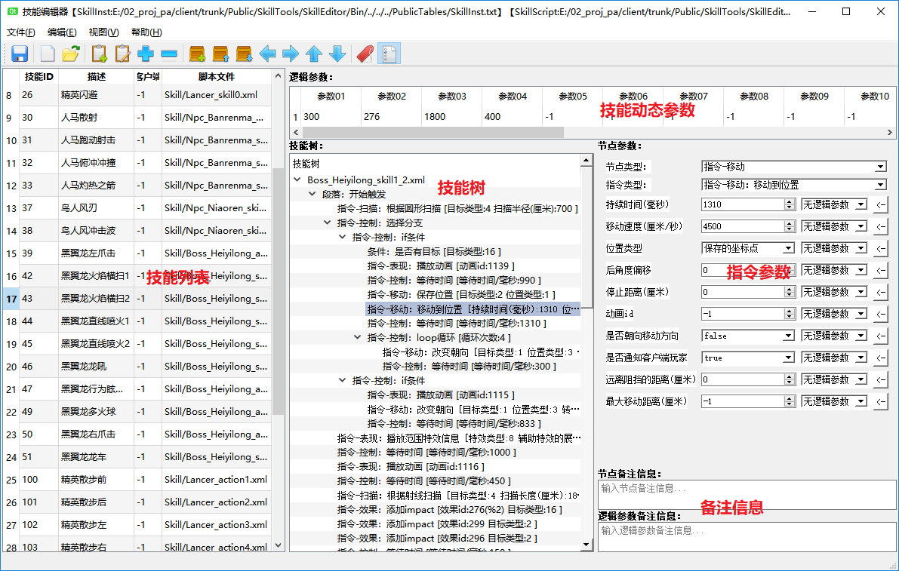
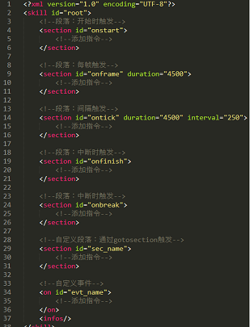
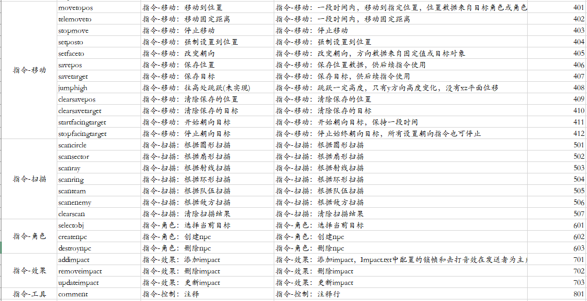
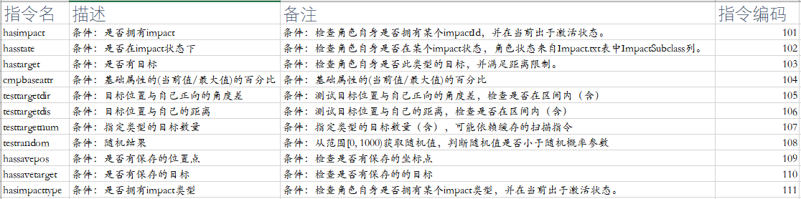
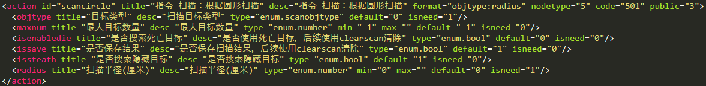

# VisualSkillEditor

**一种基于指令集的技能编辑器：将技能抽象为基于时间轴的主线（也支持控制逻辑和跳转），通过在时间轴上挂接技能指令的方式来表达技能逻辑。**

本仓库包含以下内容：

1. 全部的编辑器[代码](Sources)。
2. 编辑器相关[帮助文档wiki](https://github.com/River-Li-1024/VisualSkillEditor/wiki)。
3. 演示全部功能的[实例](Bin/Workspace)。
4. 直接可用的[Win32版本](Versions)。
5. 全部的[指令集](Bin/Config/SkillSpec.xml)及其描述说明。
6. 用于收集维护和反馈的[链接](https://github.com/River-Li-1024/VisualSkillEditor/issues/1).

更多的关于战斗的文章可移步[我的博客](https://river-li-1024.github.io/)

## 内容列表

- [背景](#背景)
- [界面](#界面)
- [文档](#文档)
    - [技能段落](#技能段落)
    - [技能指令](#技能指令)
    - [参数说明](#参数说明)
- [编译](#编译)
- [维护者](#维护者)
- [贡献者](#贡献者)
    - [如何贡献](#如何贡献)
- [使用许可](#使用许可)

## 背景

**为什么需要这样一款编辑器**
在许多类型的游戏中，良好的技能表现都是游戏的一大卖点。技能系统结构复杂，牵扯到游戏中几乎所有的基础子系统，同时为为上层逻辑提供支持。策划团队往往期望能够以一种直观、独立的方式组织技能逻辑，他们既希望可以自由组合技能逻辑，同时不希望配置过于复杂。这样的矛盾往往会让程序设计走向两个极端：
1. 一种方式是提供一种可平行扩展的方式，不断特写逻辑以满足个性化需求。这种方式在前期往往表现良好，但当项目规模膨胀到一定程度时，极有可能出现复杂度暴增导致失控的情况；
2. 另一种方式是把策划需求拆分成尽可能独立的一些子逻辑。这种方式对程序设计人员的业务抽象和代码设计能力要求极高，代码需要持续、谨慎地维护，同时解决冗余和复杂的配置方式也是一大挑战。

针对以上问题，我们引入一种基于指令集的技能系统：将技能抽象为基于时间轴的主线（也支持控制逻辑和跳转），通过在时间轴上挂接技能指令的方式来表达技能逻辑。

**提供以下特性：**

1.  提供30+条指令，全部为瞬发指令，基本满足正交性，各自独立且便于扩展；
2.  使用xml格式来保存技能逻辑，同时提供一套标准化的解析和执行运行时(额外提供)；
3.  可视化编辑，在编辑器中拖拽指令和逻辑控制结构；
4.  编辑器界面由[指令集描述文件](Bin/Config/SkillSpec.xml)自动生成，修改此文件可将工具用于于剧情编辑、AI编辑等；
5.  完善的[帮助文档wiki](https://github.com/River-Li-1024/VisualSkillEditor/wiki)；

## 界面

## 文档

### 技能段落

技能的逻辑划分成7种段落(section)，分别是：
+ 段落-开始：onstart，表示技能起始，只执行一次，完成后才开始执行其它段落；
+ 段落-帧触发：onframe，每帧触发，可设置最长总持续时间；
+ 段落-间隔触发：ontick，每间隔固定时长触发，可设置最长总持续时间；
+ 段落-结束：onfinish，技能结束触发，基本被中断也仍旧会触发结束段落；
+ 段落-中断：onbreak，技能被中断时触发，中断后会触发结束段落；
+ 段落-自定义段落：id可自定义，通过gotosection触发调用，相当于过程调用；
+ 段落-自定义事件：id可自定义，通过sendevent触发，与其他段落并发执行；

### 技能指令

**事件指令**抽象出技能逻辑中需要执行的原子事件，基本满足正交性。在指令粒度和便利性上做了一定程度的折中，以后者作为第一原则，但整体上已避免冗余。
将所有事件指令划分为7个指令组，分别是：
+ 指令-控制：用于实现控制逻辑，如流程控制，时间控制，逻辑跳转等；
+ 指令-表现：客户端表现相关指令，涉及动画、特效、相机、声音、子弹时间效果等；
+ 指令-移动：位置和朝向相关指令，既包括移动和转向指令，也包括选点和计算朝向；
+ 指令-扫描：各种扫描指令，提供多种范围搜索指令；
+ 指令-角色：角色操作指令；
+ 指令-效果：操作效果(impact)；
+ 指令-工具：辅助指令，只用于编辑器；

**条件指令**抽象出逻辑控制中可能的一些判断条件，用于运行时修改技能的执行轨迹。
>条件指令只返回true/false，供事件指令中的控制指令使用；
>只对个别必需的条件才独立为指令，因此条件指令的数目需要严格控制。
在项目实践中发现，多数策划难以驾驭过于复杂的控制逻辑，所以在设计中倾向于将条件内置到事件指令中（作为其一个参数）。

### 参数说明

每个指令都具有多个参数，通过key-value的方式描述。以scancircle(圆形扫描)为例：

如图所示，参数中规定了此指令的数据类型和范围，以及是否需要强制配置等信息

以上截图来自[指令集描述文件](Bin/Config/SkillSpec.xml)
>此文件既作为指令参数说明文档，也作为编辑器的界面配置文件，开发者需要增加指令时可自由编辑。

## 编译

下载已生成的版本：
[Win32版本](Versions)

*****
Visual Studio编译：
1. 安装环境，参考[Qt环境搭建(Visual Studio)](https://blog.csdn.net/liang19890820/article/details/49874033)
2. Visual Studio打开工程文件 SkillEditor.sln。
3. 编译工程，输出到 Bin 目录。
4. (可选)如果需要迁移到其他环境运行，执行部署文件 Bin/Deploy.cmd (需指定Qt安装目录)。

*****
Qt Creator编译：
1. 安装Qt，所有Qt版本[下载](http://download.qt.io/archive/qt/)。
2. Qt打开工程文件 SkillEditor.pro。
3. 编译工程，输出到Bin目录。
4. (可选)如果需要迁移到其他环境运行，执行部署文件 Bin/Deploy.cmd(需指定Qt安装目录)。

## 维护者

[@River.Li](https://github.com/River-Li-1024)

## 贡献者
[@stallboy(cxs)](https://github.com/stallboy)

### 如何贡献

非常欢迎你的加入! [提一个Issue](https://github.com/River-Li-1024/VisualSkillEditor/issues/new) 或者提交一个 Pull R equest.

## 使用许可

[MIT](LICENSE) © Richard Littauer
